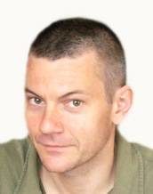

 

 </img>
  
I am a professor at [Sorbonne Université](https://www.sorbonne-universite.fr/), in the [Laboratoire de Probabilités, Statistique et Modélisation (LPSM)](https://www.lpsm.paris)

I am specialized in statistics, especially latent variable models, network models and change-point detection, and their applications in life sciences, mostly in ecology

## Contact information

- <i class="fas fa-map-marker"></i> LPSM, Sorbonne Université,  
  Office 15-25, 221,  
  4, place Jussieu, Paris 5, France
  
- <i class="fa fa-phone"></i> +33 (0)1 xx xx xx xx

- <i class="fa fa-at"></i> <a href="mailto:stephane.robin@sorbonne-universite.fr
">stephane [dot] robin [at] sorbonne [hyphen] universite [dot] fr</a>
